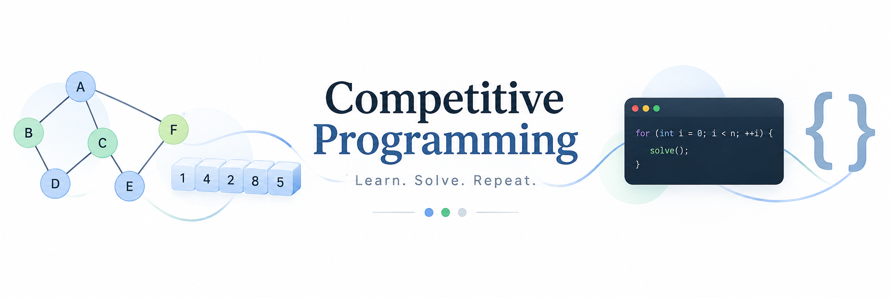

# Competitive Programming


[](https://leetcode.com/)
[](https://codeforces.com/)

A collection of my solutions to problems from LeetCode and Codeforces.

I'm using this repository to improve my problem-solving skills, learn data structures and algorithms, and get better at C++.

## Structure

```text
competitive-programming/
├── leetcode/
└── codeforces/
```

## Platforms

### LeetCode

I'm following curated problems such as LeetCode 75 to learn common data structures, algorithms, and problem-solving patterns.

### Codeforces

I'm solving beginner problems and gradually increasing the difficulty as I become more comfortable with competitive programming.

## Goals

- Improve my C++ skills
- Learn common data structures and algorithms
- Recognize problem-solving patterns
- Improve my ability to solve problems independently
- Participate in Codeforces contests

## Progress

### LeetCode

| Problem | Topic | Solution |
|---|---|---|
| [1. Two Sum](https://leetcode.com/problems/two-sum/) | Hash Map | [C++](leetcode/01-two_sum.cpp) |
| [1768. Merge Strings Alternately](https://leetcode.com/problems/merge-strings-alternately/) | Strings | [C++](leetcode/1768-merge_strings_alternately.cpp) |

### Codeforces

| Problem | Topic | Solution |
|---|---|---|
| [4A. Watermelon](https://codeforces.com/contest/4/problem/A) | Math / Conditions | [C++](codeforces/4a-watermelon.cpp) |
| [71A. Way Too Long Words](https://codeforces.com/problemset/problem/71/A) | Strings | [C++](codeforces/71a-way_too_long_words.cpp) |
